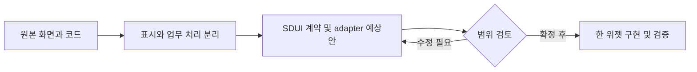

# gomgom-ai — SDUI 위젯 후보

목표: 원래 화면의 역할과 코드를 확인하고, 한 위젯씩 분리할 대상을 정한다. 기준: `main` / `991039defcd8342ab302380b11871d8b7695828b`.

음식 취향과 위치를 받아 추천·주변 식당 결과를 만드는 Django 서비스. JSON API와 manifest가 이미 있으나 모든 입력과 운영 보안이 완성된 것은 아니다.

공개 범위: 공개. LICENSE 없음: 저장소 공개 여부와 상용 재배포 권한은 별개; 원저작자·외부 데이터 권한 확인. 후보는 구현 완료나 재배포 허가를 의미하지 않는다.

9/18·19·20 KST 커밋 수: 2 / 3 / 0. 병합·문서 커밋 포함; 기능 수 아님. 일요일은 조사 시점까지만.

|ID|위젯 후보|현재 상태|분리 작업|
|---|---|---|---|
|R01-W01|음식 취향 질문|기존 화면 구현; 독립 SDUI 질문 위젯 분리 필요|qnaList를 JSON 문항 계약으로 분리하고 완료 이벤트로 types 배열 반환|
|R01-W02|음식 추천 결과|JSON API와 SDUI manifest 구현; 운영 E2E 미검증|types 내부 객체 입력(TypeError 가능), 좌표 검증, 비용 제한·권한·개인정보 필터 후 플러그인 연결|
|R01-W03|주변 식당 목록|JSON API 구현; 목록 위젯 스키마 정리 가능|카드 공통 모델로 매핑; 로딩/빈 결과/실패 상태 분리|

## R01-W01 · 음식 취향 질문

여섯 질문의 선택을 모아 추천 입력을 만든다.

|항목|내용|
|---|---|
|입력|질문 선택값, 기존 text/lat/lng|
|처리|qnaList 순서대로 선택 태그를 수집하고 다음 질문 또는 결과 경로로 이동|
|반환·화면|취향 태그와 결과 화면 이동|
|API|기존 test_result 화면 호출; SDUI에서는 recommend API 입력으로 어댑트|
|저장|브라우저 상태; 추천 요청 이후 DB와 연결|
|부수효과|페이지 이동|
|보안·분리 경계|위치정보 선택 동의와 민감한 자유입력 최소화|
|공통화 계열|질문/조건 입력|
|구현 후 통과 기준|마지막 질문 완료, 뒤로가기, 빈 선택 및 types 정규화 검증|

핵심 코드:
- [const qnaList · gomgom_ai/templates/gomgom_ai/test.html:43](https://github.com/feed-mina/gomgom-ai/blob/991039defcd8342ab302380b11871d8b7695828b/gomgom_ai/templates/gomgom_ai/test.html#L43)
- [function goNextQuestion · gomgom_ai/templates/gomgom_ai/test.html:91](https://github.com/feed-mina/gomgom-ai/blob/991039defcd8342ab302380b11871d8b7695828b/gomgom_ai/templates/gomgom_ai/test.html#L91)

## R01-W02 · 음식 추천 결과

자유문장·취향·위치로 가게 한 곳과 추천 이유를 표시한다.

|항목|내용|
|---|---|
|입력|text, lat, lng, types 최대 6개|
|처리|recommend_api 검증 → run_recommend → 요기요 응답을 받은 후 GPT 호출 → 가게 매칭·실패 대안|
|반환·화면|store,description,category,keywords,restaurant; ok/data/errors|
|API|POST /api/v1/gomgom/recommend|
|저장|Recommendation: 입력·취향·좌표·IP·성공여부·GPT 원문|
|부수효과|유료 모델 호출과 DB 기록; 읽기처럼 보여도 쓰기 발생|
|보안·분리 경계|현재 csrf_exempt; CORS는 인증이 아님. 위치/IP·모델 원문 보존 정책과 서버 인증/제한 필요|
|공통화 계열|추천 결과 카드|
|구현 후 통과 기준|성공/모델 실패/빈 식당/잘못된 types/좌표·중복 요청 비용 확인|

핵심 코드:
- [def recommend_api · gomgom_ai/views.py:681](https://github.com/feed-mina/gomgom-ai/blob/991039defcd8342ab302380b11871d8b7695828b/gomgom_ai/views.py#L681)
- [def run_recommend · gomgom_ai/views.py:389](https://github.com/feed-mina/gomgom-ai/blob/991039defcd8342ab302380b11871d8b7695828b/gomgom_ai/views.py#L389)

## R01-W03 · 주변 식당 목록

좌표 주변 최대 20개 식당을 목록으로 표시한다.

|항목|내용|
|---|---|
|입력|lat,lng|
|처리|좌표 캐시 조회; 없으면 외부 식당 조회 후 5분 캐시; 필드 정규화|
|반환·화면|restaurants 이름·평점·분류·로고|
|API|GET /api/v1/gomgom/restaurants|
|저장|Django cache restaurants:{lat}:{lng}|
|부수효과|외부 조회와 캐시 쓰기|
|보안·분리 경계|외부 API 사용권·호출제한 확인; 위치 기본값을 고객 위치로 오해시키지 않기|
|공통화 계열|장소/목록 카드|
|구현 후 통과 기준|좌표 변경 캐시키, 20개 상한, 외부 오류와 빈 목록 구분|

핵심 코드:
- [def restaurants_api · gomgom_ai/views.py:730](https://github.com/feed-mina/gomgom-ai/blob/991039defcd8342ab302380b11871d8b7695828b/gomgom_ai/views.py#L730)

## 예상 작업 순서

이번 조사: 정적 소스 확인. 앱 실행·운영 API·실제 고객 화면 동등성은 검증하지 않았다. 위 흐름은 향후 작업 계획이며 현재 앱 호출 흐름이 아니다.

---

## 화면에서 코드를 따라 읽기

화면 동작 → 처리 코드 → 요청·저장 → 반환과 부수효과 → 수정·검증 순서로 읽는다. UI가 없는 후보는 표시 화면을 새로 만드는 제안이다. 이 문서는 기존 조사 SHA를 기준으로 재구성했으며 최신 앱 실행 검증이 아니다.

### R01-W01 · 음식 취향 질문

여섯 질문의 선택을 모아 추천 입력을 만든다.

**현재 상태:** 기존 화면 구현; 독립 SDUI 질문 위젯 분리 필요

|화면·코드 연결|확인 내용|
|---|---|
|화면에 나오는 결과|취향 태그와 결과 화면 이동|
|화면이 받는 값|질문 선택값, 기존 text/lat/lng|
|담당 로직|qnaList 순서대로 선택 태그를 수집하고 다음 질문 또는 결과 경로로 이동|
|요청 창구|기존 test_result 화면 호출; SDUI에서는 recommend API 입력으로 어댑트|
|저장소 경계|브라우저 상태; 추천 요청 이후 DB와 연결|
|반환과 별도인 동작|페이지 이동|

**핵심 파일의 확인 지점**

- [const qnaList](https://github.com/feed-mina/gomgom-ai/blob/991039defcd8342ab302380b11871d8b7695828b/gomgom_ai/templates/gomgom_ai/test.html#L43) — `gomgom_ai/templates/gomgom_ai/test.html`에서 이 기능의 선언·호출·계약을 확인한다. 코드 링크는 원래 조사 SHA에 고정되어 있다.
- [function goNextQuestion](https://github.com/feed-mina/gomgom-ai/blob/991039defcd8342ab302380b11871d8b7695828b/gomgom_ai/templates/gomgom_ai/test.html#L91) — `gomgom_ai/templates/gomgom_ai/test.html`에서 이 기능의 선언·호출·계약을 확인한다. 코드 링크는 원래 조사 SHA에 고정되어 있다.

**유지보수 시 변경할 범위:** qnaList를 JSON 문항 계약으로 분리하고 완료 이벤트로 types 배열 반환
**보안·공통화 경계:** 위치정보 선택 동의와 민감한 자유입력 최소화
**회귀 확인:** 마지막 질문 완료, 뒤로가기, 빈 선택 및 types 정규화 검증

### R01-W02 · 음식 추천 결과

자유문장·취향·위치로 가게 한 곳과 추천 이유를 표시한다.

**현재 상태:** JSON API와 SDUI manifest 구현; 운영 E2E 미검증

|화면·코드 연결|확인 내용|
|---|---|
|화면에 나오는 결과|store,description,category,keywords,restaurant; ok/data/errors|
|화면이 받는 값|text, lat, lng, types 최대 6개|
|담당 로직|recommend_api 검증 → run_recommend → 요기요 응답을 받은 후 GPT 호출 → 가게 매칭·실패 대안|
|요청 창구|POST /api/v1/gomgom/recommend|
|저장소 경계|Recommendation: 입력·취향·좌표·IP·성공여부·GPT 원문|
|반환과 별도인 동작|유료 모델 호출과 DB 기록; 읽기처럼 보여도 쓰기 발생|

**핵심 파일의 확인 지점**

- [def recommend_api](https://github.com/feed-mina/gomgom-ai/blob/991039defcd8342ab302380b11871d8b7695828b/gomgom_ai/views.py#L681) — `gomgom_ai/views.py`에서 이 기능의 선언·호출·계약을 확인한다. 코드 링크는 원래 조사 SHA에 고정되어 있다.
- [def run_recommend](https://github.com/feed-mina/gomgom-ai/blob/991039defcd8342ab302380b11871d8b7695828b/gomgom_ai/views.py#L389) — `gomgom_ai/views.py`에서 이 기능의 선언·호출·계약을 확인한다. 코드 링크는 원래 조사 SHA에 고정되어 있다.

**유지보수 시 변경할 범위:** types 내부 객체 입력(TypeError 가능), 좌표 검증, 비용 제한·권한·개인정보 필터 후 플러그인 연결
**보안·공통화 경계:** 현재 csrf_exempt; CORS는 인증이 아님. 위치/IP·모델 원문 보존 정책과 서버 인증/제한 필요
**회귀 확인:** 성공/모델 실패/빈 식당/잘못된 types/좌표·중복 요청 비용 확인

### R01-W03 · 주변 식당 목록

좌표 주변 최대 20개 식당을 목록으로 표시한다.

**현재 상태:** JSON API 구현; 목록 위젯 스키마 정리 가능

|화면·코드 연결|확인 내용|
|---|---|
|화면에 나오는 결과|restaurants 이름·평점·분류·로고|
|화면이 받는 값|lat,lng|
|담당 로직|좌표 캐시 조회; 없으면 외부 식당 조회 후 5분 캐시; 필드 정규화|
|요청 창구|GET /api/v1/gomgom/restaurants|
|저장소 경계|Django cache restaurants:{lat}:{lng}|
|반환과 별도인 동작|외부 조회와 캐시 쓰기|

**핵심 파일의 확인 지점**

- [def restaurants_api](https://github.com/feed-mina/gomgom-ai/blob/991039defcd8342ab302380b11871d8b7695828b/gomgom_ai/views.py#L730) — `gomgom_ai/views.py`에서 이 기능의 선언·호출·계약을 확인한다. 코드 링크는 원래 조사 SHA에 고정되어 있다.

**유지보수 시 변경할 범위:** 카드 공통 모델로 매핑; 로딩/빈 결과/실패 상태 분리
**보안·공통화 경계:** 외부 API 사용권·호출제한 확인; 위치 기본값을 고객 위치로 오해시키지 않기
**회귀 확인:** 좌표 변경 캐시키, 20개 상한, 외부 오류와 빈 목록 구분
