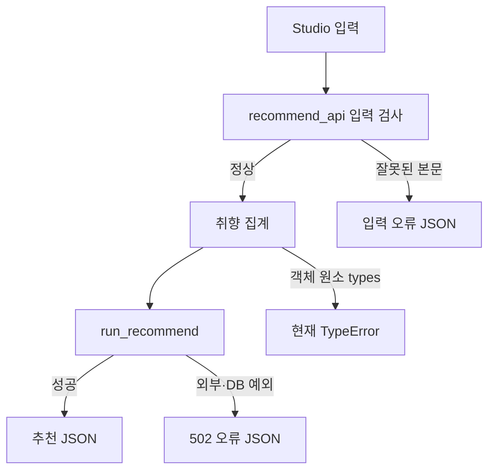

# gomgom-ai — screen-code-handover 업데이트 인수인계

한국시간 2026년 9월 18~19일 업데이트 보고서. 활동 집계 마감은 9월 19일 21:24:15입니다.

입력한 음식·기분과 취향으로 식당을 추천하는 프로젝트입니다. 이번에는 기존 화면 외에 화면편집기가 사용할 JSON 요청 창구가 추가됐습니다.

| 항목 | 기준 |
|---|---|
| 보고서 범위 | 이번 기간의 변경과 관련 기능. 전체 시스템 설명은 아래 기존 상세 문서로 연결합니다. |
| 확인 브랜치 | main |
| 소스 기준 | `382249fef5e1` |
| 검증 범위 | 분리 검사에서 types=["active"]는 정상 응답, types=[{}]는 TypeError: unhashable type: dict를 재현했습니다. |
| 보고서 세트 | [쉬운 설명](easy-guide.md) · [수정·검증 지시](fix-guide.md) · [코드 인수인계](screen-code-handover.md) |

## 이번 변경의 경계

- 9월 18일 인수인계 PDF를 추가했습니다.
- 9월 19일 PR #2로 추천·주변 식당 JSON API, manifest와 입력·출력 규칙을 추가했습니다.
- 화면편집기 저장소의 gomgom 호스트 플러그인이 이 창구를 호출하도록 별도로 추가됐습니다.

이번 업데이트의 핵심은 문서·계약·서버 처리입니다. 실행 화면을 새로 캡처하지 않았으며 확인하지 않은 화면을 실제 실행 결과로 제시하지 않습니다.

## 핵심 파일과 역할

| 핵심 파일 | 함수·컴포넌트 | 담당 역할 |
|---|---|---|
| [gomgom_ai/views.py](https://github.com/feed-mina/gomgom-ai/blob/382249fef5e1ef15d015f47ce4426e5840fbff94/gomgom_ai/views.py) | recommend_api / restaurants_api | 추천과 식당 목록을 JSON으로 반환합니다. 입력 검사와 오류 봉투, 목록 캐시를 처리합니다. |
| [gomgom_ai/urls.py](https://github.com/feed-mina/gomgom-ai/blob/382249fef5e1ef15d015f47ce4426e5840fbff94/gomgom_ai/urls.py) | URL 매핑 | 새 API 경로를 해당 view에 연결합니다. |
| [gomgom_ai/models.py](https://github.com/feed-mina/gomgom-ai/blob/382249fef5e1ef15d015f47ce4426e5840fbff94/gomgom_ai/models.py) | Recommendation | 기존 추천 결과의 저장 모델입니다. API 추가를 DB 구조 변경으로 오해하지 않습니다. |
| [sdui/gomgom-ai/template.manifest.json](https://github.com/feed-mina/gomgom-ai/blob/382249fef5e1ef15d015f47ce4426e5840fbff94/sdui/gomgom-ai/template.manifest.json) | 화면 manifest | 입력·결과 카드와 플러그인 계약을 연결합니다. |

## 입력·처리·반환과 부수 효과

| 담당 기능 | 입력 | 처리와 분기 | 반환·출력 | 별도로 일어나는 변경 |
|---|---|---|---|---|
| recommend_api | text,lat,lng,types | 본문 객체·text 검사, 취향 집계, run_recommend 호출 | {ok,data:{store,description,category,keywords,restaurant},errors} | 기존 추천 함수의 외부 조회·기록 사용 |
| restaurants_api | query.lat,lng | 캐시 조회, 없으면 외부 목록 조회 후 300초 저장 | 이름·평점·분류·이미지 목록 최대 20개 | 캐시 갱신 |
| _error | code,message,status | 실패 응답과 허용 출처 헤더 조립 | JSON 오류 응답 | 없음 |

## 동작 흐름

화살표는 호출·데이터 전달 또는 조건 분기를 뜻합니다. 도식에 없는 운영 연결은 확인되지 않았습니다.

## 데이터와 연결 관계

| 저장·전달 대상 | 주요 값 | 관계와 주의점 |
|---|---|---|
| 요청 | text,types,lat,lng | types 목록 원소의 자료형 검사가 필요합니다. |
| 추천 응답 | store,description,category,keywords,restaurant | Studio 결과 카드가 소비합니다. |
| 목록 캐시 | restaurants:{lat}:{lng} | 좌표별 키이며 DB 외래키 관계가 아닙니다. |

## 유지보수와 확인 순서

| 바꾸거나 확인할 것 | 확인 위치와 기준 |
|---|---|
| 입력 오류 | types의 컨테이너와 각 원소를 모두 검사합니다. |
| 외부 호출 | run_recommend 오류와 입력 단계 오류의 처리 범위를 구분합니다. |
| 프런트 연결 | Studio의 작업 이름 gomgom.recommend.run과 결과 카드 n_result를 함께 확인합니다. |

이번에는 recommend_api 함수를 AST로 분리하고 추천 함수를 모의 값으로 대체했습니다. 실제 추천·DB·외부 API는 호출하지 않았습니다.

## 검증 결과와 남은 범위

분리 검사에서 types=["active"]는 정상 응답, types=[{}]는 TypeError: unhashable type: dict를 재현했습니다.

Django 전체 서버, 외부 식당 조회·모델 생성, 실제 Studio 배포 연동은 이번에 실행하지 않았습니다.

## 기존 상세 문서와 활동 근거

- [API 계약](https://github.com/feed-mina/gomgom-ai/blob/382249fef5e1ef15d015f47ce4426e5840fbff94/sdui/gomgom-ai/api-contract.md)
- [기존 인수인계 PDF](https://github.com/feed-mina/gomgom-ai/blob/382249fef5e1ef15d015f47ce4426e5840fbff94/GOMGOM-AI_%ED%99%94%EB%A9%B4-%EC%BD%94%EB%93%9C-%EC%9D%B8%EC%88%98%EC%9D%B8%EA%B3%84.pdf)
- [Studio 연결 코드](https://github.com/feed-mina/sdui-template-kit-productization/blob/4ffa0608a65718032a986c53542c3e6a72b13ca4/studio/sdui-gomgom.js)

| 한국시간 | 커밋 | 기록된 작업 | 구분 |
|---|---|---|---|
| 09/19 15:49 | [382249f](https://github.com/feed-mina/gomgom-ai/commit/382249fef5e1ef15d015f47ce4426e5840fbff94) | Merge pull request #2 from feed-mina/sdui/main-manifest | 병합 기록 |
| 09/19 13:12 | [573f327](https://github.com/feed-mina/gomgom-ai/commit/573f327abbda6b8baf2dd9755da1ba210fb000b4) | feat(sdui): 메인 화면 SDUI manifest와 추천 JSON 창구 추가 | 변경 기록 |
| 09/18 19:04 | [74892ac](https://github.com/feed-mina/gomgom-ai/commit/74892ac2e75bc89abe4390a41069c4de31937cc8) | Merge pull request #1 from feed-mina/copilot/create-hand-off-documentation | 병합 기록 |
| 09/18 19:02 | [8a0c9e5](https://github.com/feed-mina/gomgom-ai/commit/8a0c9e577e3101b2ab66cb08df728f9ef2a9829c) | Add screen-to-code handover PDF | 변경 기록 |
